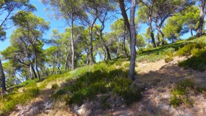

# Les pinèdes

## de nos régions

C'est trop joli. Il y a plein de pins.



Note de Joris : Attention, j'ai corrigé l'adresse de l'image. Puisque nous travaillons dans un projet, il faut juste écrire images/pinede.jpg et non pas C:/Users/c.gritti/Documents/CEFE_book/... 

# 2e partie : les pollinisateurs des pins

## ça n'existe pas

Par contre il y en a en dessous pour le romarin et le thym.

```{r, echo = FALSE, include=FALSE}

#chargement des packages
library(tidyverse)
library(kableExtra)

export_TAG_3011_net <- read_delim("data/export_TAG_3011_net.csv", 
    delim = ";", escape_double = FALSE, col_types = cols(id_releve = col_character()), 
    trim_ws = TRUE)

```


```{r}
kable(export_TAG_3011_net[1:10,c(24, 73, 83)], align = 'c') %>%
  kable_styling(latex_options = "striped")
```

