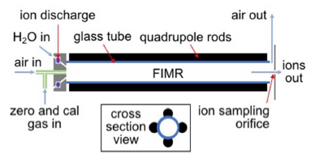

# Présentation de la PTR-ToF-MS

De très nombreux projets de recherche issus du CeMEB nécessitent l'analyse de **C**omposés **O**rganiques **V**olatils (COV ou VOC en anglais) aussi communément appelés "odeurs". Les COVs sont omniprésents dans la nature et permettent, avec les autres sens, une organisation du vivant en agissant comme vecteur d'information de la médiation chimique. Par l'acquisition d'un PTR-ToF-MS, la communauté souhaitait lever trois verrous techniques :

-   l'appareil permet un fonctionnement en flux continu avec une résolution temporelle très fine (fréquence d'analyse allant jusqu'à 10 scans par seconde), permettant ainsi le suivi des cinétiques d'émissions de COV. Cet instrument simplifie drastiquement et affine les expériences cinétiques effectuées par des mesures moyennées de GC-MS;\
-   le PTR-ToF-MS possède une excellente résolution en masse qui facilite l'identification des molécules. Un **spectre** est composé de plus de 140 000 mesures de masses couvrant une large gamme des masses des COV biologiques (de 70 à 500 m/z). L'appareil possède donc une résolution environ mille fois supérieure par rapport à un simple quadripôle (PTR-MS ou GC-MS) qui fournit des m/z à l'unité de masse atomique (uma ou Dalton Da);\
-   le seuil de détection extrêmement bas, de l'ordre du ppt (part per trillion), permet une sensibilité adaptée à la mesure de traces.

## Une brève histoire de la PTR-ToF-MS

Durant la décennie 1990, l'*Institut für Ionenphysik der Leopold-Franzens-Universität* d'Innsbruck en Autriche développe un nouvel instrument pour l'analyse chimique des gaz. En travaillant avec la *Universitiitsklinik fiir Innere Medizin*, l'équipe menée par Lindinger développe un spectromètre en phase gazeuse qui ionise les molécules grâce à un gaz neutre ([@lindinger_1991] et [@lindinger_1993]). Ils comprennent rapidement l'avantage d'utiliser un proton (apporté à la réaction sous la forme H~3~O^+^) par rapport aux ions Kr^+^ et Xe^+^. Ils publient une sorte de preuve de concept en 1994 [@lagg_1994] et détaillent plus finement l'instrumentation et les réactions chimiques [@hansel_1995][^1]. En 1998 sort l'article qui fait désormais référence, [@lindinger_1998a], signé par le trio Lindinger, Hansel et Jordan (et sa version courte @lindinger_1998).

[^1]: avec des remerciements incroyables

Ionicon commercialise la même année le premier PTR-MS. Cette technique se déploie rapidement dans les sciences de l'atmosphère, médicales et biotech ([@babcock_2001]) permettant la détection de traces de COV. Rapide et sensible, la PTR-MS élimine certains désavantages de la GC-MS. Cependant, la PTR-MS détecte de la masse nominale des ions. Un échantillon complexe peut contenir plusieurs ions isobares[^2]. Il convient alors de gagner en résolution de masse et séparer ces isobares. [@jordan_2009] revient sur les tentatives les plus concluantes ([@blake_2004], [@ennis_2005], [@inomata_2006] et [@tanimoto_2007] ) avant de proposer son approche : la PTR-ToF-MS. Développé en collaboration avec la précédente équipe, le minutieux article de [@graus_2010] conclu superbement la vingtaine d'années de développement nécessaire à cette technique. Les années suivantes permettront simplement une amélioration des différentes parties de l'instrument.

[^2]: molécules possédant un nombre de nucléons identique.

Par ailleurs, c'est au tour des mathématiciens d'apporter leur contribution et en particulier à l'équipe de Cappellin avec deux articles. Le premier, [@cappellin_2010], permet de mieux estimer la masse exacte de chaque ion détecté. Le seconde, [@cappellin_2011], offre une méthodologie détaillée de l'utilisation du PTR-ToF-MS de l'acquisition à la fin de l'analyse. Puis en 2015, [@holzinger_2015] propose un logiciel pour l'analyse des data mais cette tentative n'a pas été suivie par la communauté d'utilisateurs. Il existe désormais un nombre important d'articles utilisant la PTR-ToF-MS. Bien entendu, des outils communs de chimiométrie ont été utilisés pour renforcer les résultats, [@deuscher_2019]. Mais cela sera abordé dans le chapitre suivant.

Je suppose que la prochaine avancée majeure viendra d'une technologie permettant de discriminer les isomères[^3] [@amt-14-133-2021] [^4]. Par exemple, cela permettrait de séparer les différents monoterpènes omniprésents dans les émissions végétales et qui nous concernent particulièrement en écologie chimique. Actuellement, ce désavantage est comblé par le couplage de la PTR-ToF-MS avec une seconde technique d'analyse chimique. Ce court historique montre toutefois que la collaboration entre physiciens, chimistes, biologistes et mathématiciens est fructueuse et promise à un bel avenir.

[^3]: molécules partageant la même formule brute mais avec un agencement tridimensionnel différent.

[^4]: si un mémoire de master permettait la science fiction, j'aurais évidemment développé quelques idées à propos de capteurs de champs électromagnétiques ou de spectromètres optiques à la place des capteurs MS actuels.

## Instrumentation générale

{#fig:schemavocus}

Comme nous l'avons vu précédemment, le PTR-ToF-MS est conçu pour analyser finement la masse moléculaire des échantillons. Pour cela l'instrument aspire un débit d'air constant de 100 ml/min[^5]. Cet *air in* sur la figure \@ref(fig:schemavocus) peut être connecté à un gaz zéro pour diluer un échantillon trop concentré (pour éviter la saturation) ou à un gaz étalon pour l'étalonnage de l'instrument. Le flux d'air est ensuite injecté dans le réacteur (*FIMR* pour *focusing ion-molecule reactor*). Dans cette chambre, des ions H^+^ issus d'eau ultra pure sont également injectés à débit constant afin d'ioniser les molécules de l'échantillon (*Proton-Transfer-Reaction*).

[^5]: ou sccm, pour *standard cubic centimeters per minute*

Il est important de comprendre que, contrairement à une ionisation par électron[^6], il n'y a quasiment pas de fragmentation moléculaire. C'est une ionisation douce, comme en ESI (ElectroSpray Ionization) fréquemment utilisée en LC-MS. Les ions ont "une unité de masse molaire de plus"(un proton) que les ions moléculaires. Par exemple, le linalol, un COV fortement produit par la lavande, a une masse molaire de 154,249 g/mol mais sera detecté à 155,256 g/mol. Par ailleurs, le nombre d'ions MH^+^ détectés dépend du taux de protonation de la molécule M. Sous forme d'ions, l'échantillon peut être focalisé par un champ électromagnétique généré par un quadripôle et envoyé dans la partie ToF.

[^6]: comme c'est le cas en ionisation électronique fréquemment utilisée en GC-MS.

Une fois dans la colonne, l'énergie potentielle d'un pulse électromagnétique à 25kHz est convertie en énergie cinétique par les ions propulsés. À énergie constante, la masse fait la différence lors de la mesure du temps de vol (ToF, figure \@ref(fig:schemaToF)). Ainsi les ions les moins lourds arrivent en premiers sur le détecteur. Le comptage du nombre de coups sur le détecteur donne l'intensité par unité de temps. Un étalonnage, avec des ions moléculaires étalons, permet de convertir le *temps de vol* en *masse*, ce qui permet par la suite d'analyser les masses des échantillons inconnus.

{#fig:schemaToF}

Pour une compréhension plus exhaustive, je recommande la lecture des articles de @hansel_1995 pour la partie PTR-MS, de @graus_2010 pour la partie ToF et de @krechmer_2018 spécifique à l'instrument utilisé au CEFE.

## Analyse et conclusion

### Le plan d'expérience

Pour illustrer cela, je présenterais une expérience sur les lavandes. Cette expérience s'inscrit dans un cadre d'un projet MUSE (Montpellier Université d'Excellence) porté par Magali Proffit et s'intéressant aux phénomènes de pollution à l'Ozone O_3 liés au changement climatique global. Nous nous sommes intéressés aux variations journalières des émissions de COV de lavandes isolés dans des chambres de prélèvements. Les acquisitions se déroulaient durant 48h à cheval sur trois jours et deux nuits afin de décrire le rythme circadien des plantes.

Nous avons mis en place quatre chambres de mesure permettant chacune soit d'isoler un plant de lavande soit d'être un blanc. Ces chambres de mesure sont des cylindres en plastique, ventilés, de volumes équivalents et reliés à un flux d'air zéro d'un débit de 5 litres/min. La longueur et le volume des lignes reliant les chambres à l'instrument de mesure n'étaient pas identiques. Nous avons lancé des acquisitions sur les quatre chambres séquentiellement durant 48h. Nous avons répété ce processus deux fois, pour obtenir neuf plants au total dans notre plan d'expérience (cf. \@ref(tab:PlanXP)).

```{r PlanXP, echo = FALSE}
load("data/tea_als_lav.RData")
library(magrittr)
library(lubridate)
library(viridis)
library(scales)
library(kableExtra)

name_ech <- c("lv1", "lv2", "lv3", "bl1",
              "lv4", "lv5", "lv6", "bl2",
              "lv7", "lv8", "lv9", "bl3")

xt <- as.numeric(rownames(tea.als$CList[[1]]))
nech <- length(tea.als$CList)

# tableau 
# tabl <- matrix(name_ech,4,3,dimnames = list(c("voie 1","voie 2","voie 3","voie 4"),c("J1","J2","J3"))) %>% as.data.frame()
# 
# knitr::kable(tabl, caption = "Plan d'experience",
#     booktabs = TRUE) %>%
#     kableExtra::kable_styling(bootstrap_options = "striped",
#         full_width = FALSE)

```

## Résultats de la MCR

```{r MCRloadings, echo = FALSE, fig.cap="Spectres purs, loadings MCR", fig.width= 5, fig.height= 3}
###################
fmr <- dim(tea.als$S)
matS <- seq(1,0,-.25,) %>% matrix(fmr[1],fmr[2],byrow = TRUE)
matS <- matS + tea.als$S
massS <- rownames(tea.als$S) %>% as.numeric()

ncMCR <- 5

# plot Rapport 
layout(1,1,1)
#png(filename = "images/lavandes_S_MCR.png", width = 600, height = 400)
  par(mar = c(3,3,0.1,0.1), mgp = c(2,1,0))
    matplot(massS,matS, type = "l", xlim = c(57,210), ylim = c(0,1.3), 
            lty = 1, lwd = c(1,2,1,2,1), col = alpha(viridis(5),0.8),
            xlab = "m/z (Da)", ylab = "Intensity (u.a.)" )
    legend("topright", legend = paste("Comp.", 1:ncMCR), bty = "n", lty = 1, col = alpha(viridis(5),0.8), lwd = c(1,2,1,2,1), cex = 0.5)
#dev.off()
```

```{r MCRscores,echo = FALSE, fig.cap="Evolution cinetique des spectres purs", fig.width= 5, fig.height= 3}
##
tC <- rownames(tea.als$CList[[1]]) %>% as.numeric()
aa <- 6
bb <- 9

#png(filename = "images/lavandes_C_MCR.png", width = 600, height = 750)
layout(matrix(c(1:4,5:8,9:12),4,3),c(aa+1,aa,aa),c(bb,bb,bb,bb+1))
for(i in 1:12){
matC <- tea.als$CList[[i]]

if(i %in% 1:3)         par(mar = c(0.1,4  ,0.1,0.1), mgp = c(2.5,1,0), xaxt = "n", yaxt = "s", cex.lab = 1.5, cex.axis = 1.5)
if(i %in% 4)           par(mar = c(4  ,4  ,0.1,0.1), mgp = c(2.5,1,0), xaxt = "s", yaxt = "s", cex.lab = 1.5, cex.axis = 1.5)
if(i %in% c(8,12))     par(mar = c(4  ,0.1,0.1,0.1), mgp = c(2.5,1,0), xaxt = "s", yaxt = "n", cex.lab = 1.5, cex.axis = 1.5)
if(i %in% c(5:7,9:11)) par(mar = c(0.1,0.1,0.1,0.1), mgp = c(2.5,1,0), xaxt = "n", yaxt = "n", cex.lab = 1.5, cex.axis = 1.5)

matplot(tC,matC, type = "l",
        lty = 1, lwd = c(1,2,1,2,1), col = alpha(viridis(5),0.8),
        xlab = "Time of day (hour)", ylab = "Intensity (u.a.)" )
abline(v = c(6,22), lty = 2, col = c("darkgoldenrod1","blue4"))
text(1,max(matC)*0.9, labels = name_ech[i], cex = 1.5)
}
#dev.off()
##
```

Les spectres issus de ces expériences sont ensuite analysés avec des outils de chimiométrie pour explorer au maximum toute la complexité des données à traiter. Certains algorithmes, comme la MCR-ALS, permettent le développement de modèles multivoies pour prendre en compte l'aspect cinétique de la PTR-ToF-MS.

J'ai utilisé l'algorithme de la MCR-ALS pour décomposer le spectre total en spectres purs( \@ref(fig:MCRscores) ). Ces spectres purs sont des ensembles de COV représentatifs d'un phénomène propre. En optimisant la MCR-ALS, j'ai fait ressortir, entre autres, l'évolution de deux spectres purs montrant un double cycle d'émission journalier ( \@ref(fig:MCRscores) ). La première activité intervient peu après l'aube, atteint un pic d'émission autour de 8h et diminue rapidement pour retrouver un niveau comparable au niveau initial vers midi. La seconde activité plus tardive augmente jusqu'à un plateau atteint vers midi et se prolonge jusqu'à 16h pour décroître par la suite.

\newpage

## Bibliographie
